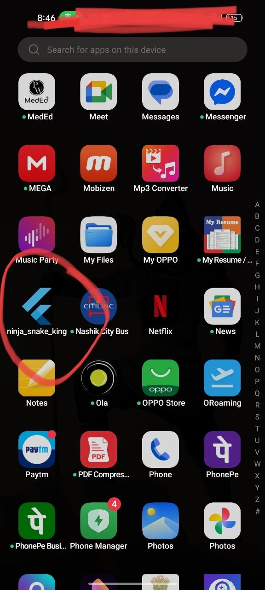
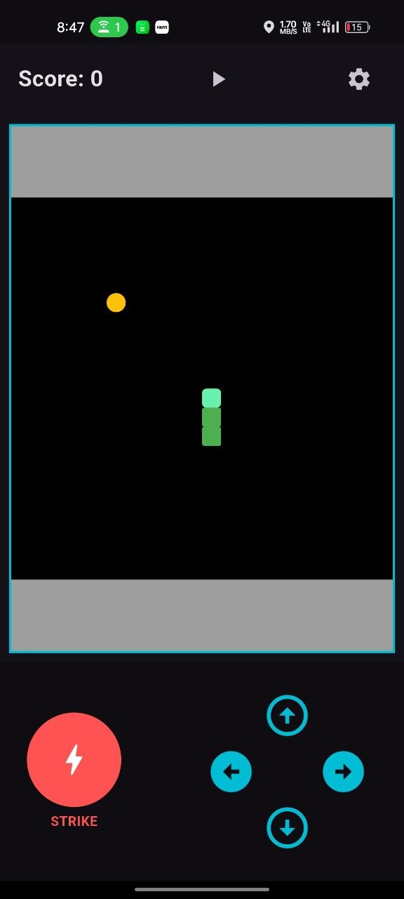
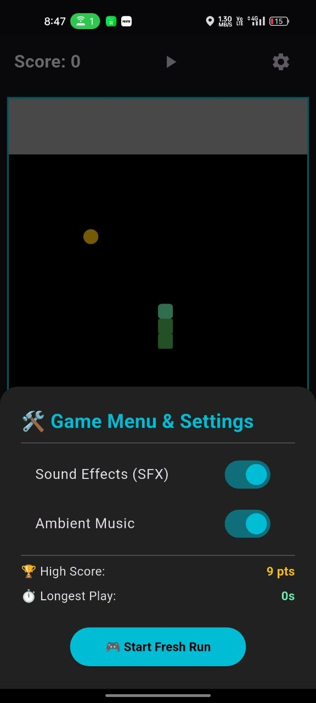

# The Ninja Snake

### Project Description

*
    1. About App ==>

The Snake Game is one of the Oldest Coding Challenge As a Project.

So I Decided to Use this Same Challenge as a Project For this Assignment.

    2. State Management ==>

This Application Uses Ephemeral (Local) State Management Combined With the Change Notifier/Callback Pattern.

    3. Screen With Dynamic Data ==>

In Terms of Screen With Dynamic Data is as Follows

    The 'Snake Game Screen' is the Screen. This Screen Continuously Reads the Changing Variables from the Game Engine and Transforms them into Visual Elements on your Device Screen

    4. Interactions that Updates UI Using State Management ==>

        In this architecture, interactions change the state variables inside GameEngine, which then triggers a callback to SnakeGameScreen. The screen runs setState(), forcing a UI rebuild to paint the updated numbers and coordinates [1].

                Main App ==:>

*

*

                Home Screen ==:>

*

*

                Menu Section ==:>

*

*

                Trial of the App ==>

*

## Getting Started

This project is a starting point for Learning all the Dart Programming Basics Needed for OOP related coding.

A few resources to get you started if this is your first Flutter project:

- [Learn Dart](https://www.geeksforgeeks.org/dart/dart-tutorial)
- [Tutedude](https://www.tutedude.com)