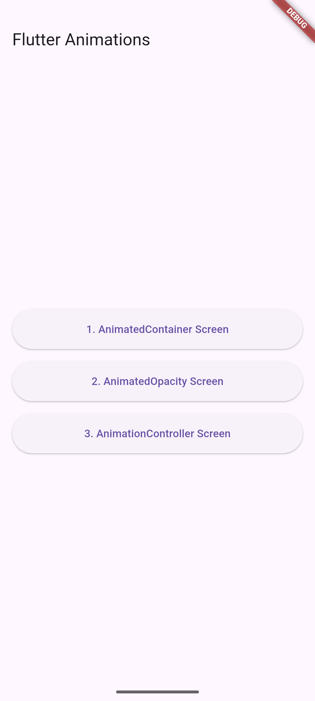
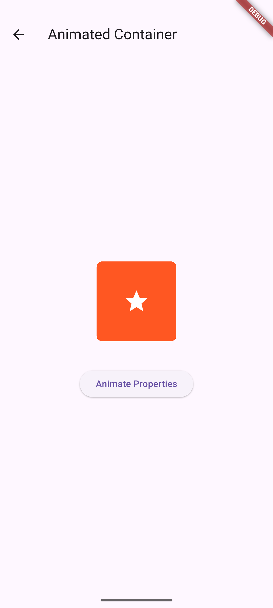
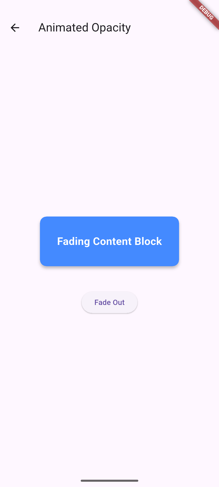
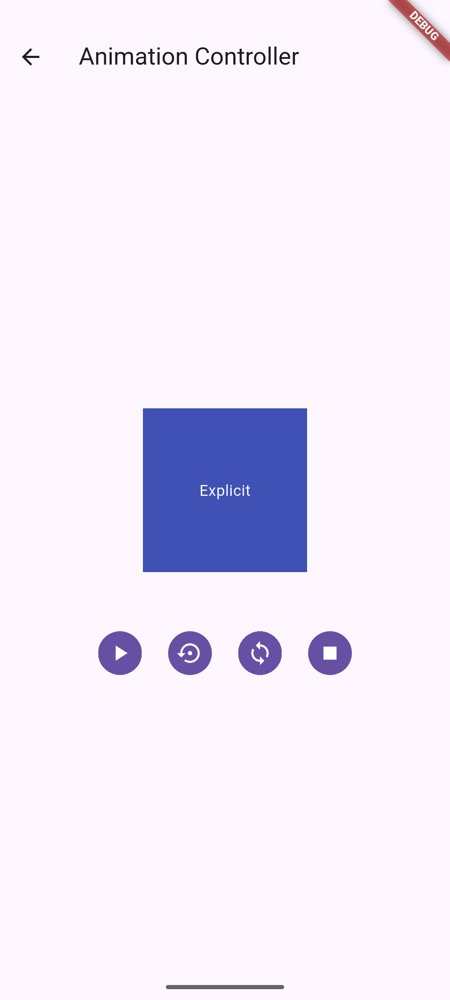

# The Animation Example

### Project Description

*
    1. About App ==>

The App so Created is an App With Examples of 3 animation screens.

The App Uses 3 Screens Each one Dedicated to 3 animation techniques,
    A. Animated Containers
    B. Animated Opacity
    C. Animation Controller

Navigation Between Animation Screens is Achieved through Dedicated Back Buttons.

            Home Screen ==:>

*

*

The AnimationContainer is an implicitly animated version of the standard Container widget. It allows oy uto Smoothly Transition Properties like Width, Height, Color and Padding over a set Period of Time Without Needing to Manually Manage.

                Animation Container Initial ==:>

*

*

When we click on the Animate Properties Button, Flutter Triggers a Multi-Step UI Rendering Process that Smoothly Recalculates and Redraws the Shape over 500 Milliseconds.

                Animated Container After Triggering ==:>

*

*

When we Click the Fade Out or Fade In Button, Flutter Modifies the Transparency Layer of the Widget by Changing its Opacity Values.

                Initial Opacity Look ==>

*

*

                After Clicking Fade Out Button ==>

*

*

 Unlike the first two screens which handle animations automatically, the Animation Controller page uses explicit animation. This means you have total manual control over the animation's timing, playback direction, and execution

                Initial Animation Controller Page ==>

*

*

                Animation Controller Trial Video ==>

*

## Getting Started

This project is a starting point for Learning all the Dart Programming Basics Needed for OOP related coding.

A few resources to get you started if this is your first Flutter project:

- [Learn Dart](https://www.geeksforgeeks.org/dart/dart-tutorial)
- [Tutedude](https://www.tutedude.com)