# The Smart Home Our Play 

### Project Description

*

(The Name of the App is Taken From the Guardian Eva of Avatar.) 

    1. About App ==>

The FLutter App to be Build is an Application that Works Well on:

        a. Mobile Phones
        b. Tablets
        c. Larger Screens

While Thinking on an Application that Fits this Criteria, The Best Application is A Smart Home Application. An Application that Needs to Display Information on Smart phones for Remote View, Tablets for Installed Control Panels(Tablets) in Homes at Living Room, Kitchen or Hall. At The Same Time on Large Screens Like TV for Reviews or Security and Analysis.  

The Application Fetches the Screen Dimensions to Find out what length and Width is Available and the creates a Layout Best Fit for the Available Size.

    2. About the Usage of:

        A. MediaQuery ==>

MediaQuery is Used for Global Screen Context.
'desktop_dashboard' and 'camera_feed_page' Utilize 'MediaQuery' to read the Absolute Width of the Device Screen

        B. LayoutBuilder ==>

LayoutBuilder is Used for Local Widget Constraints or Inside your Layout Structures to Read the Exact Remaining Width After Sidebars, Dividers, and Margins have taken their Share of the Space.

    3. Adaptive Behaviour ==>

This Was The Hardest Part Of the Assignment. To Summarize the Overall Project in this Aspect we can say,

This application prevents layout overflows by combining fluid grid layouts, flexible boxes, scrollable list structures, and adaptive constraints. Instead of hardcoding element dimensions in pixels, the app lets components wrap, scale, or reposition based on the available space.

    For Other 2 Points Be Sure to Checkout the Below Screenshot

                Desktop View ==:>

*
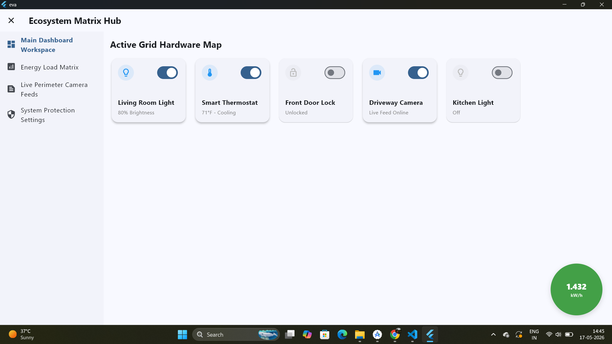
*

*
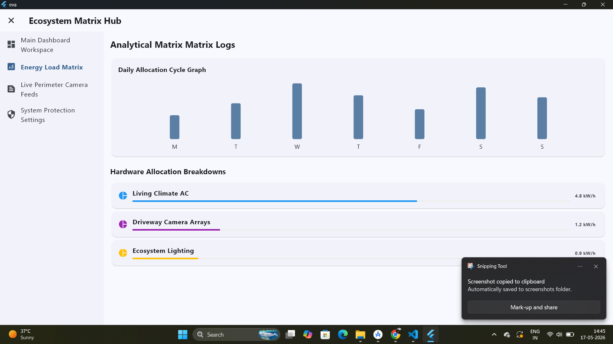
*

*
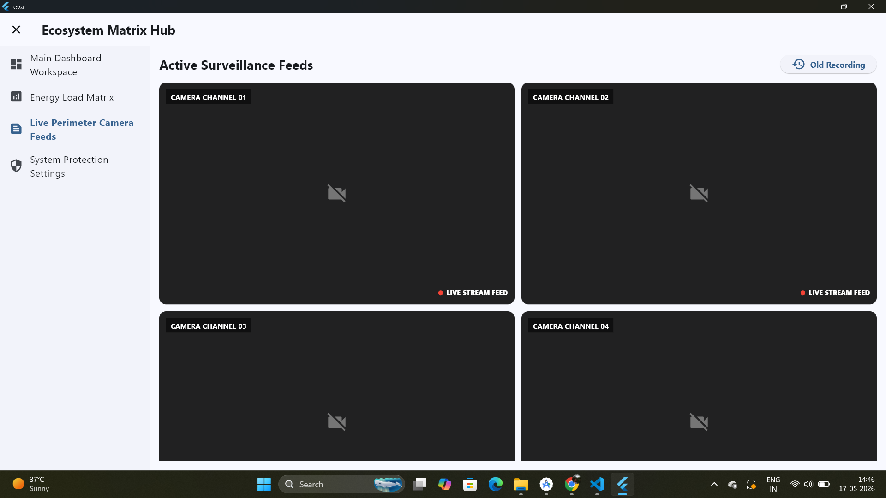
*

*
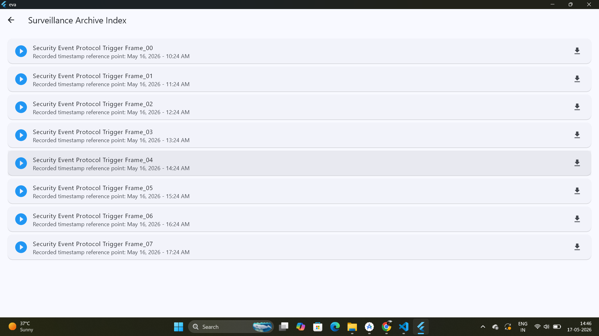
*

*
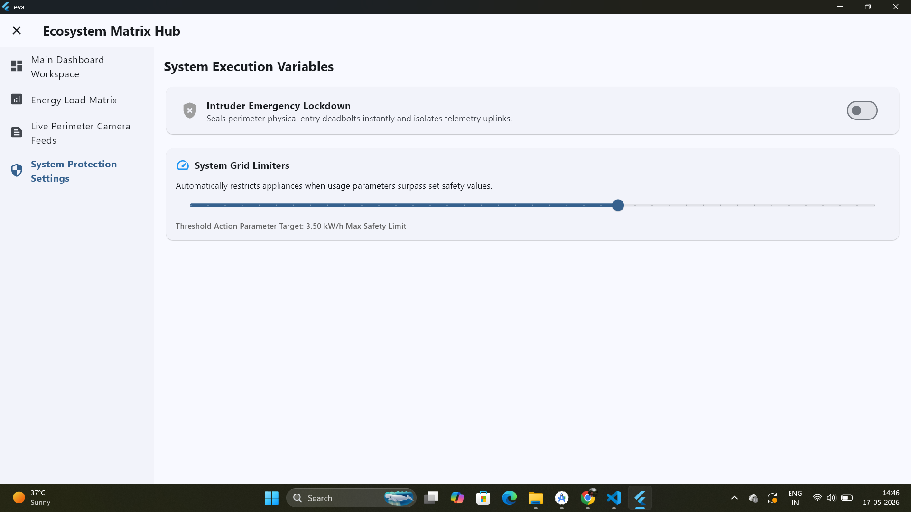
*

                Tablet View ==:>

*
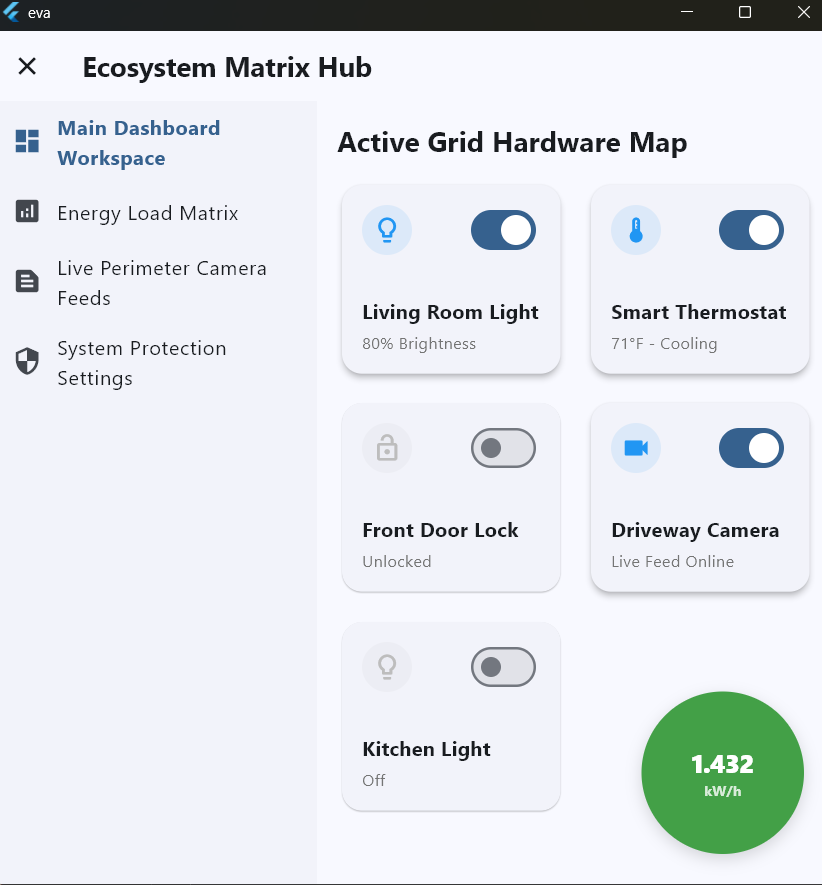
*

*
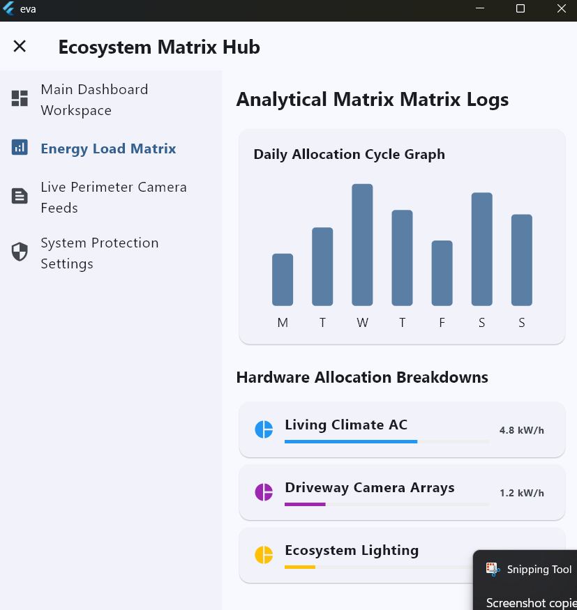
*

*
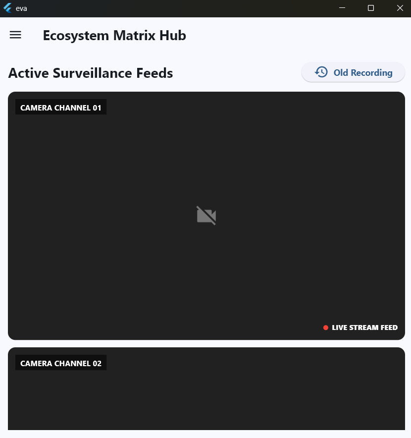
*

*
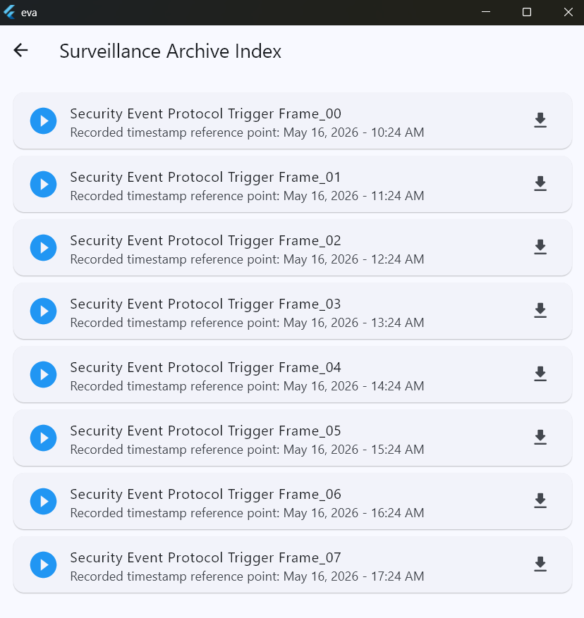
*

*
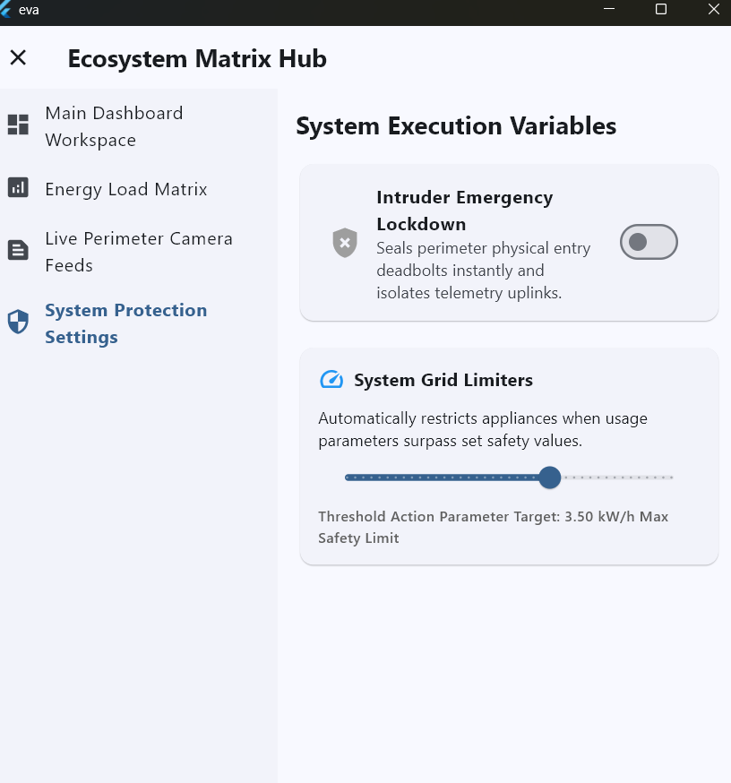
*

                Mobile View ==:>

        The Closeable Sidebar

*
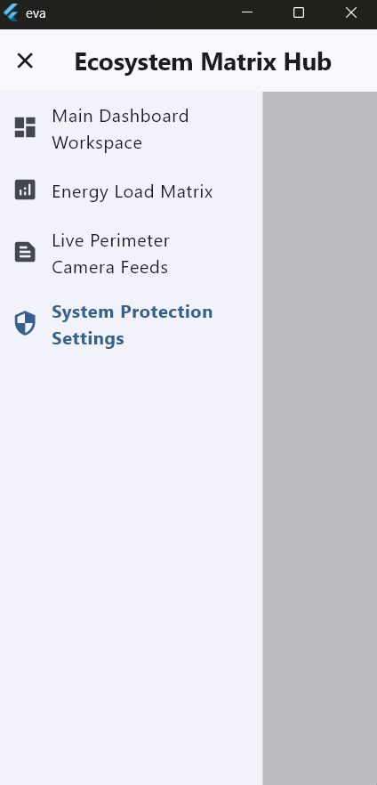
*

*
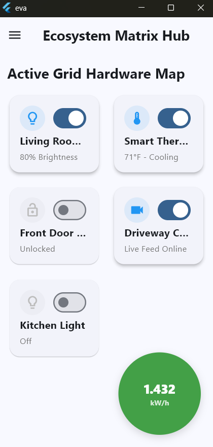
*

*
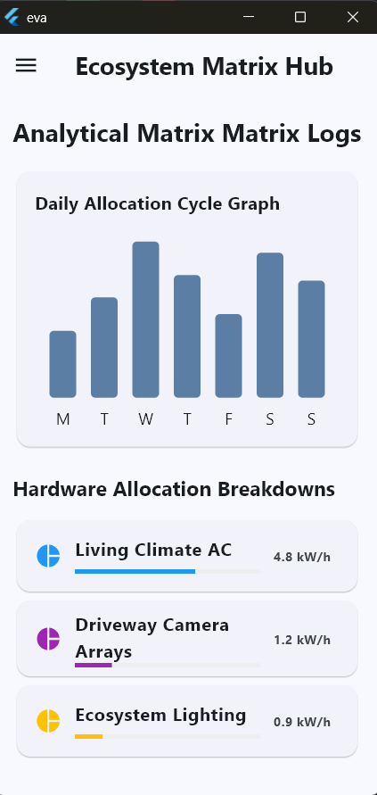
*

*
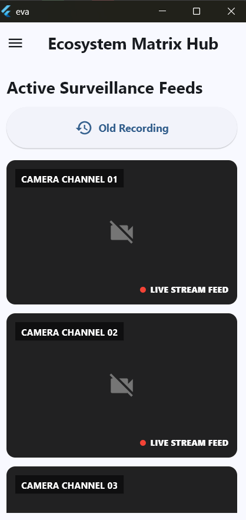
*

*
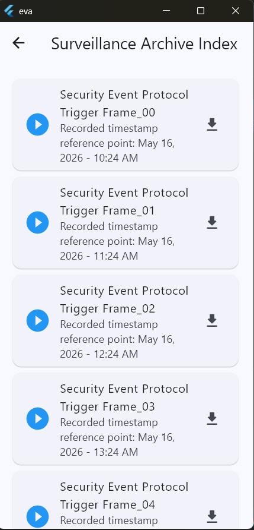
*

*
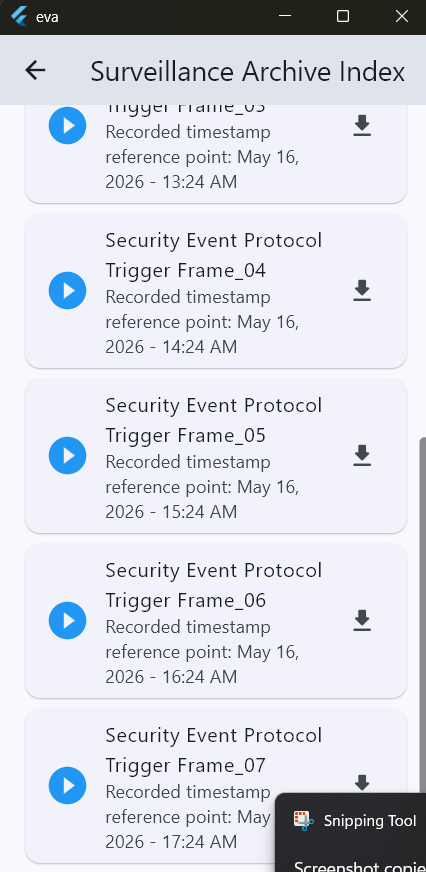
*

        Also all the Widgets have been Designed as Proactive, Ready for Integration

*
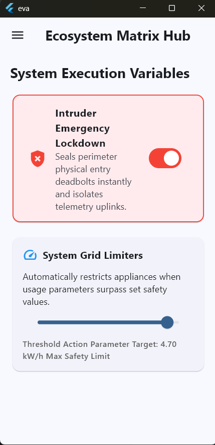

## Getting Started

This project is a starting point for Learning all the Dart Programming Basics Needed for OOP related coding.

A few resources to get you started if this is your first Flutter project:

- [Learn Dart](https://www.geeksforgeeks.org/dart/dart-tutorial)
- [Tutedude](https://www.tutedude.com)
