# Weather app all anew

### Project Description

*

            App Successful Installation

*
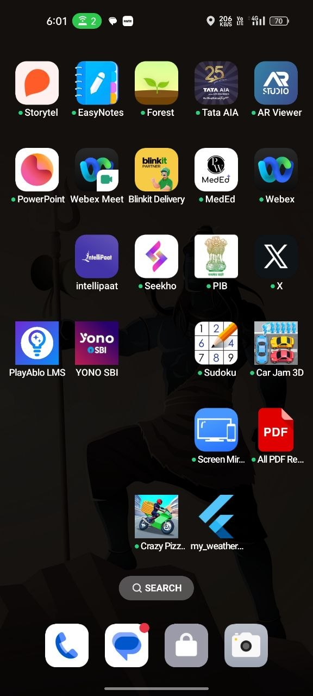
*

                    Launch Page

*

*
    
    
    
    1. How the project Works
        
        
        A. Project Architecture

The application uses a Layered Architecture Split by feature. This separates logic handlers (services) entirely from your display elements (presentation/widgets) to make sure code changes on one screen won't accidentally break another.

*
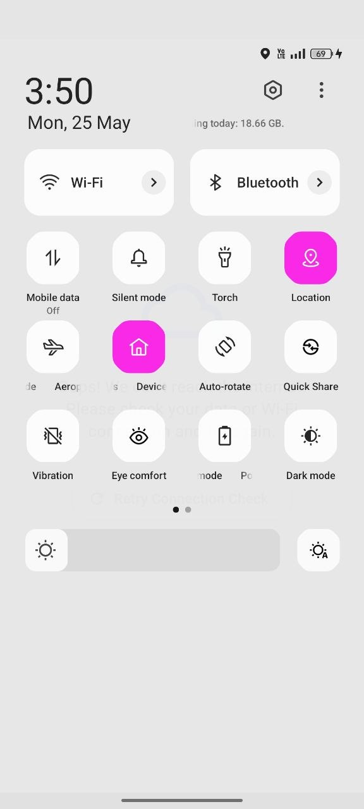
*

*

*

        B. Core System Fuctionalities

            a. Smart Permission and Initialisation Wizard

                Target Objective: Seamless onboarding that avoids immediate platform rejections.
                
                How it works: On first boot, SetupFlowHandlerPage utilizes permission_handler to ask for geographic tracking permissions.
                
                Graceful Failure Fallback: If a user hits "Deny," instead of crashing or freezing, the UI dynamically displays a friendly instruction banner accompanied by an "Open App Settings" shortcut button so users can quickly fix permissions manually.

*
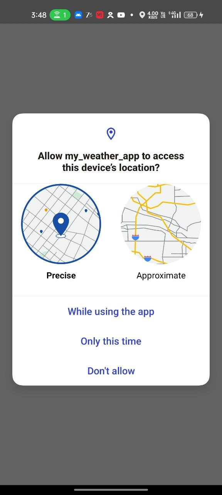
*

    Api Access:=>

*
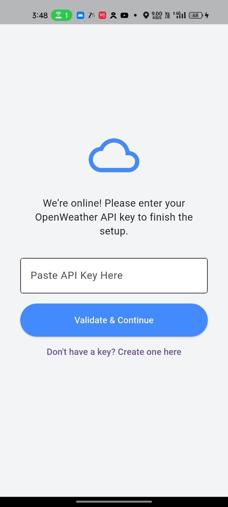

*

*

    C. Deep-Link Website Redirection
    
        Target Objective: Help users generate an API token without cluttering the app design.
        
        How it works: The onboarding page features a button linked to the url_launcher plugin. When clicked, it automatically opens the device's native browser background stack and drops the user directly onto the OpenWeather API key subsection registration screen.

*
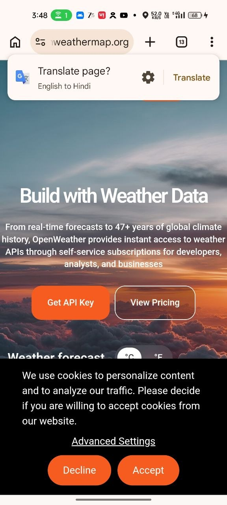
*

        Login Page : =>

*

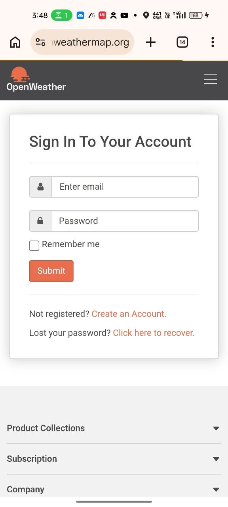
*

        Open Weather Page Login Success

*
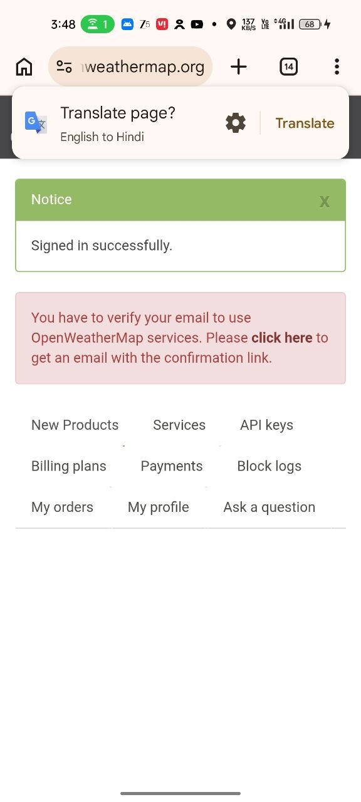
*

        API Key Accessed : =>

*

*

        API Verified Display Screen :=>

*
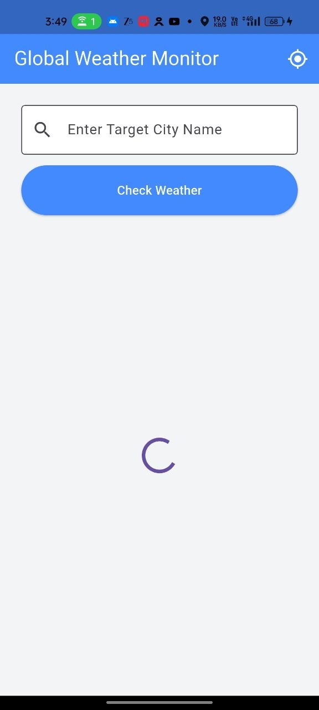
*

        Default Local Weather Output :=>

*
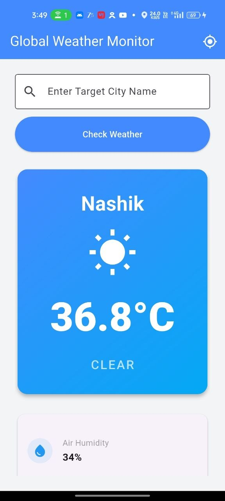

*

    D. Dual-Layer Connectivity Guard

        Target Objective: Handle varying network hardware responses accurately across mobile devices and desktops (Windows).
        
        How it works: It uses the connectivity_plus plugin to verify active radio networks. If the plugin returns an error (a common bug on desktop machines), a secondary InternetAddress DNS ping (google.com) checks for a live data stream to ensure reliable online verification.

            Tab View :=>

*
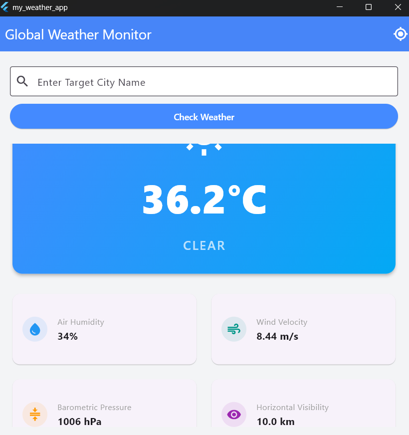
*

            Desktop :=>

*
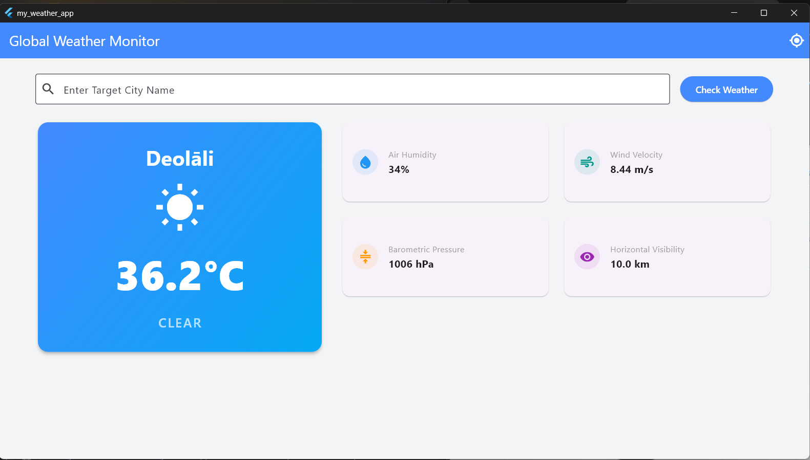
*

    E. Automated GPS Location Syncing
    
        Target Objective: Immediate local data discovery without typing.
        
        How it works: Upon successful validation of the API key, the geolocator engine attempts to pull raw coordinate data (latitude and longitude). If the device's GPS switches are on, it queries OpenWeather via coordinates to load the user's local weather instantly. If GPS is off, it displays a helpful notification card requesting location activation and displays a manual city search fallback instead.    

*

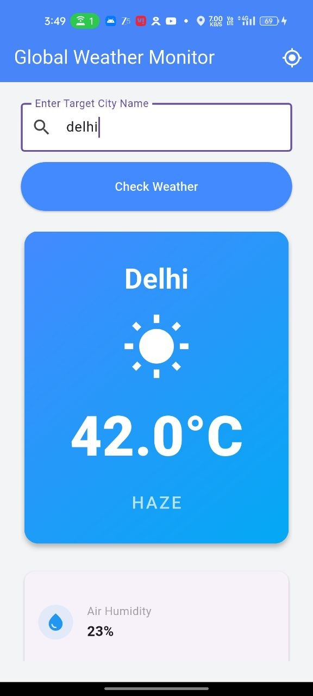
*

*
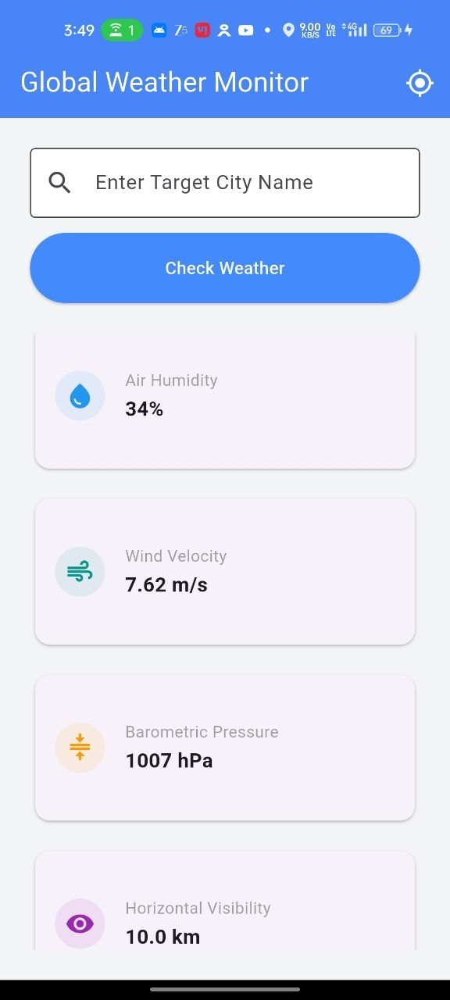

*

    F. Safe API JSON Deserialisation
    
        Target Objective: Prevent common application runtime crashes due to structural mutations in web payloads.
        
        How it works: The app uses http parameter dictionaries to bypass string-link interpolation bugs. It safely checks and casts nested data (like OpenWeather's unique weather list-of-maps array) to avoid type 'List' is not a subtype of type 'Map' runtime errors.
*P

*

    G. Responsive UI Framework Grid
    
        Target Objective: Single-codebase support for Mobile, Tablet, Desktop, and TV screens.
        
        How it works: The weather_dashboard_page.dart listens to real-time viewport width metrics.
        
            Wide Layout (TV/Desktop/Landscape Tablet > 800px): Displays a spacious, multi-column row with primary parameters positioned on the left and technical grid metrics anchored on the right.
            
            Vertical Layout (Phones/Portrait Tablets <= 800px): Shifts automatically into an organized vertical scrolling view layer with a spacious card layout optimized for touch control.

*

## Getting Started

This project is a starting point for Learning all the Dart Programming Basics Needed for OOP related coding.

A few resources to get you started if this is your first Flutter project:

- [Learn Dart](https://www.geeksforgeeks.org/dart/dart-tutorial)
- [Tutedude](https://www.tutedude.com)