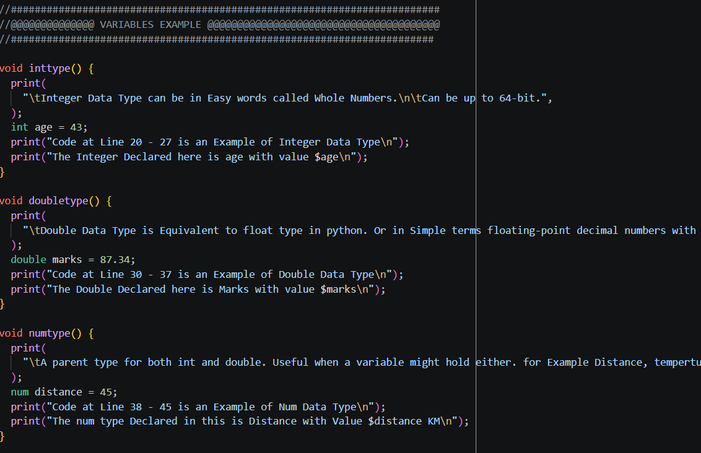
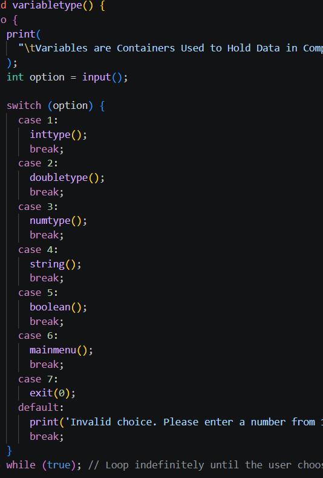
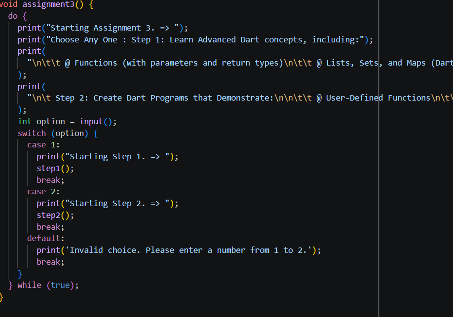
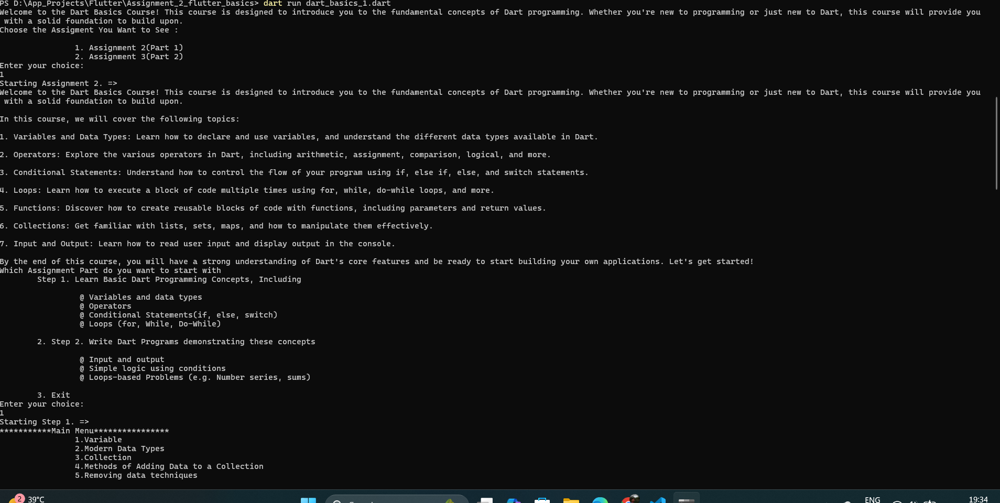
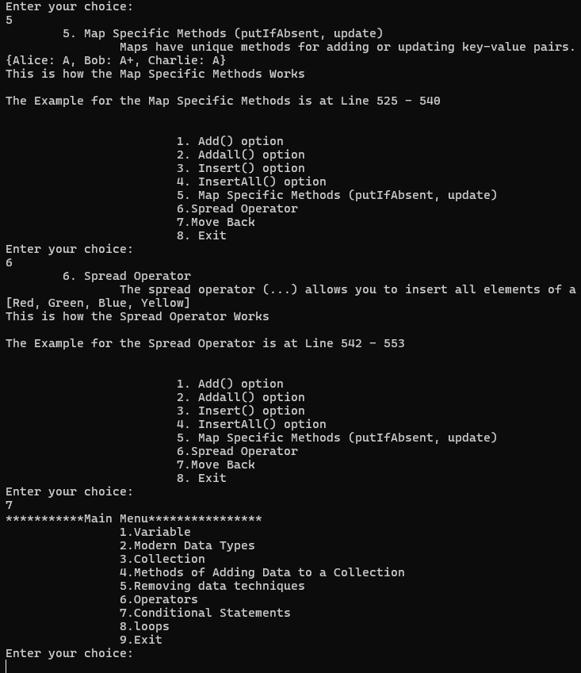

# Dart Basic Example

### Project Screenshots

*

This is an Example Screenshot of all the Function Seperated Example code into Well Structured Proper named Form

*

*

This is an Example Screenshot of How the Endless do-while loop-in-loop structure of code makes you can go and see every Example from code

*

*

This is the Screenshot of the Section mostly all code blocks Return to via Move Back option

*

*

When the code is run via dart run .... on Terminal This is how the Structure of the loops will unfold as per your selection

*

*

Every Code Returns A Special Line Telling the Reader the Exact Line Numbers in Which the Example Code Spans whether Function Declaration, Class or any other Related Segment

*

## Getting Started

This project is a starting point for Learning all the Dart Programming Basics Needed for OOP related coding.

A few resources to get you started if this is your first Flutter project:

- [Learn Dart](https://www.geeksforgeeks.org/dart/dart-tutorial)
- [Tutedude](https://www.tutedude.com)