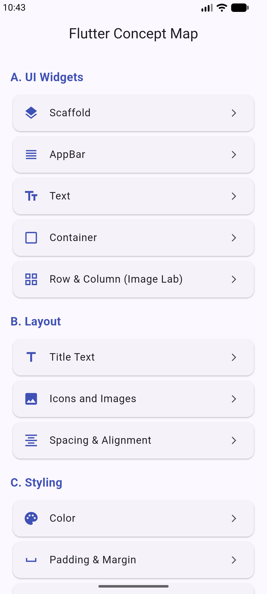
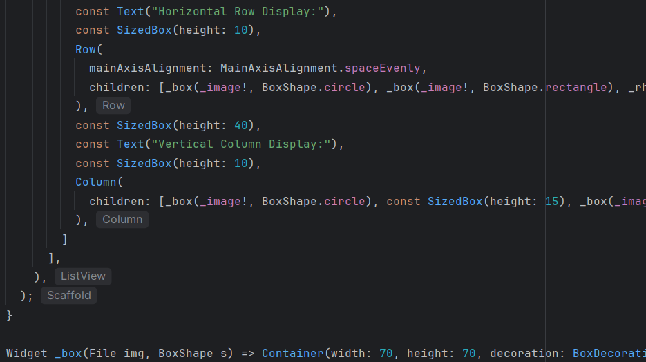
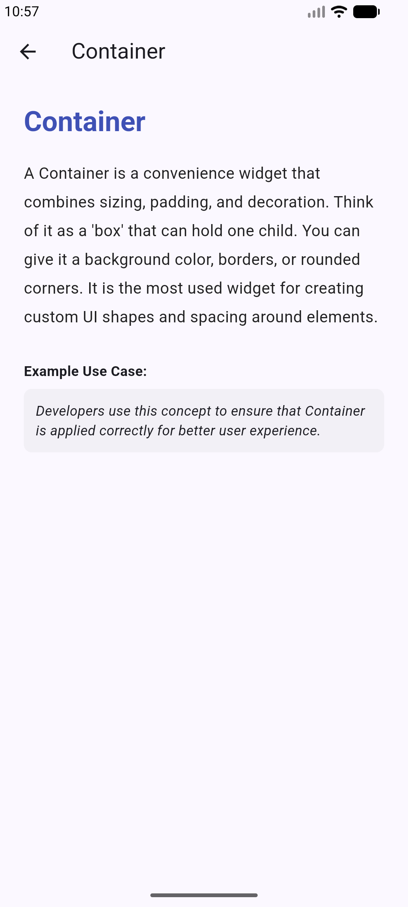
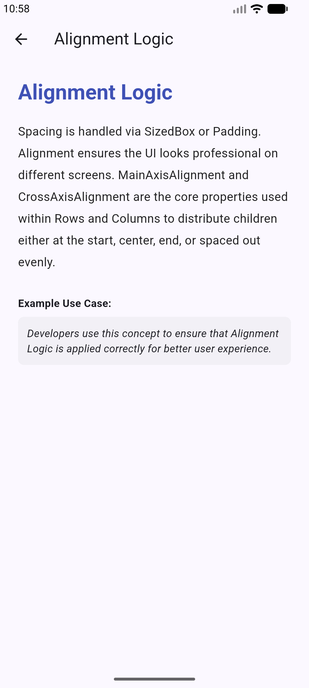
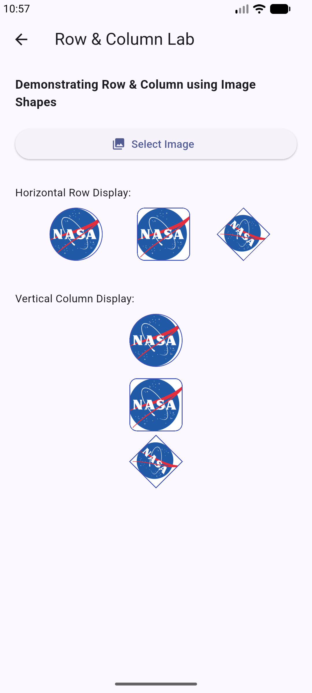

# Flutter UI Basics 1

### Project Screenshots

*

Well When Working on This Assignment One of the Biggest Thought was What Good Is a Project Which Doesn't Help Us in Learning More. With That In Mind I Decided to Integrate Learning into Project. You get a Description What we Learn on What we Learned > Nice Idea Right

*
*

This is Our Home Screen With the List of All the Concepts to be Studied...

*

*

After Clicking on the Concept You Want to Understand A Descriptive Tab Regarding the Same Will Appear...;;

        Example 1 :=> Scaffold

*

*

Side By Side You Can Checkout the Code Screenshot With Proper Brackets 

*

*

        Example 2 :=> Container

*

*

        Example 3 :=> Alignment Logic

*

*

When Any Group of Elements is to be Arranged in Row or Columns A Structure Is Followed. For this Assignment We will be Using Images as Element to be Aligned as per the Need. But Our Emulator has non so We Will Download One From Google. The Image of NASA Logo...

*

*

Next Up We Upload the Image Via the Upload Button

*P

*

The Difference Between How Alignment and Spacing Works In Row and Column Logic Can be Seen in How Each of the Elements Get Arranged

*

## Getting Started

This project is a starting point for Learning all the Dart Programming Basics Needed for OOP related coding.

A few resources to get you started if this is your first Flutter project:

- [Learn Dart](https://www.geeksforgeeks.org/dart/dart-tutorial)
- [Tutedude](https://www.tutedude.com)
