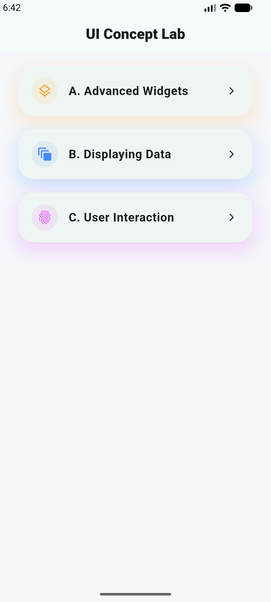
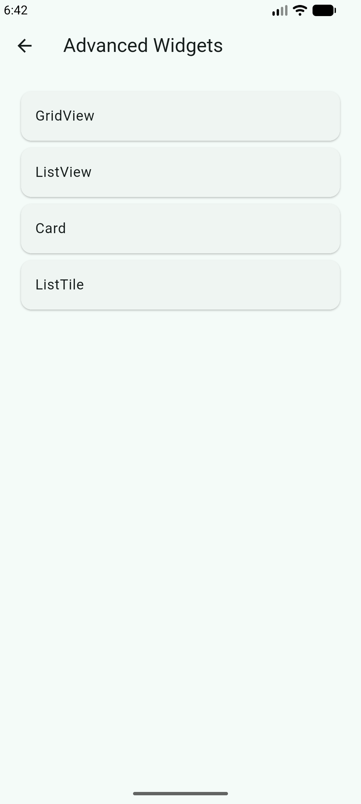
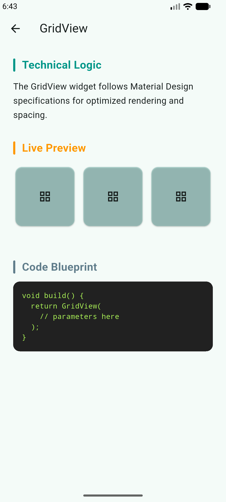
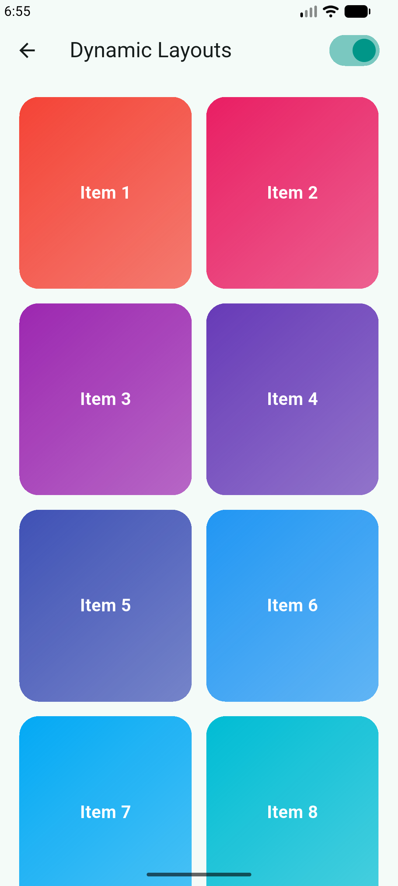
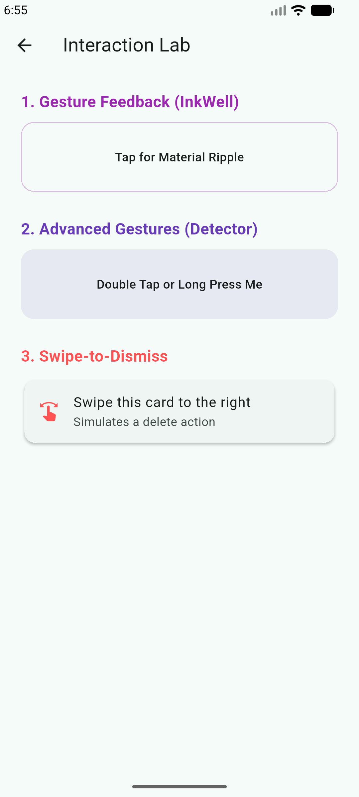
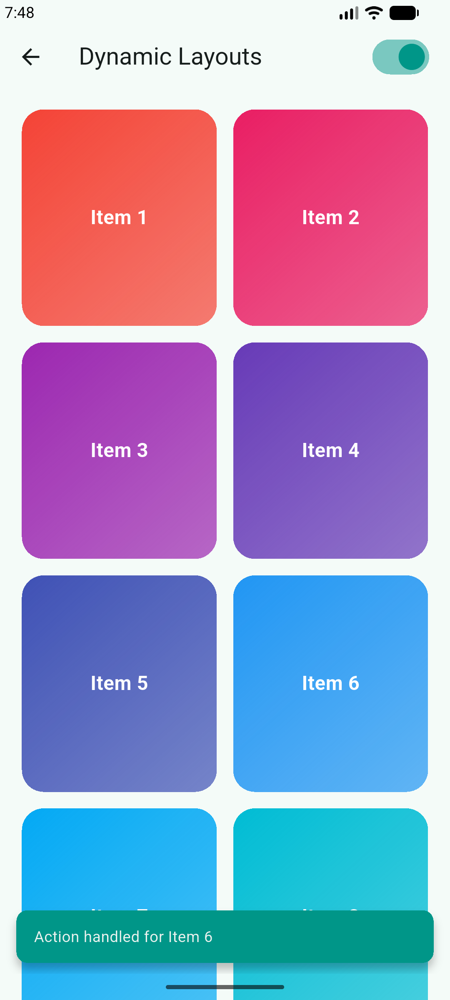
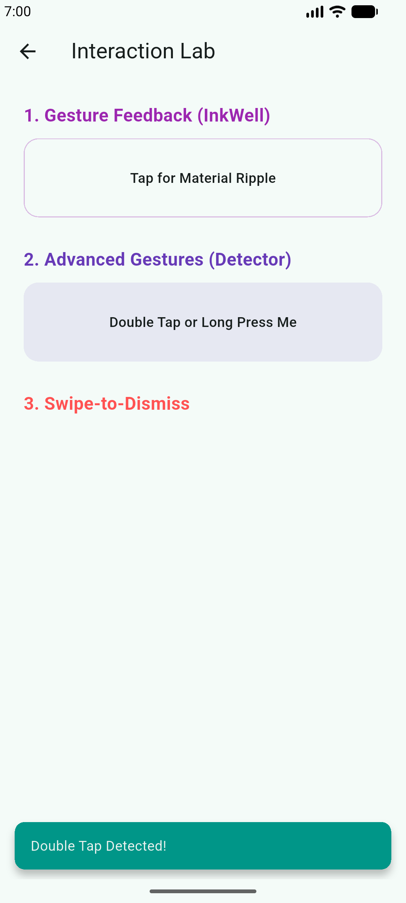
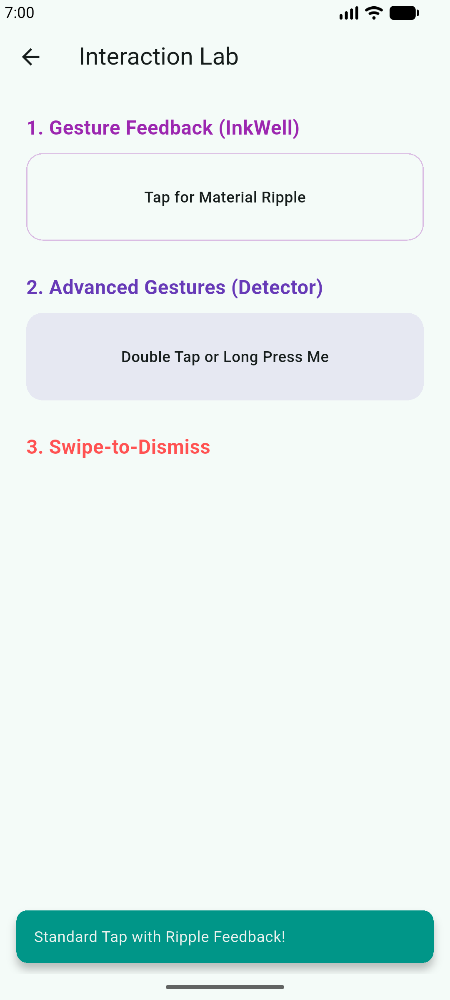

# Flutter UI Basics 2

### Project Description

*

Well When Working on This Assignment One of the Biggest Thought was What Good Is a Project Which Doesn't Help Us in Learning More. With That In Mind I Decided to Integrate Learning into Project. You get a Description What we Learn on What we Learned > Nice Idea Right

*
*

This is Our Home Screen With the List of All the Concepts to be Studied In This Specific Assignment...

*

*

After Clicking on the Concept You Want to Understand A More Comprehensive Structure For Better Understanding and a proper Demo Will Appear...;;

        Example 1 :=> Advanced Widgets

*

*

Advanced Widgets Contain a List. The List Contains The Concepts To be Studied in Step 1:

*

*

        Example 2 :=> GridView Example. The GridView Contains A Heading Description of What a Grid Really is Below It is An Example Code of How to Apply GridView

*

*

        Example 3 :=> Card Example. Similarly We can See Another Example Of What Cards Really are 

*

*

Going Forward to Step 2; We Have the option to Choose Any of the 2 A scrollable List or Grid Layout. So When You Click on Displaying Data We Get A Screen With A Toggle Bar At Top to Select If We Want to View the List In Grid Form or List Form

                Grid Layout :=>

*

*

                List Layout :=>

*

*

The Are Many Ways A User can Interact With Device In Terms Of Click

*

*

                Example 1 :=> Simple Tap. This is the Trigger In Which You Simple Click On the Widget and Get Our Output....
                In The Below Example A Flash Message Is Displayed After a Simple Click....

*

*

                Example 2 :=> Double Tap. Double Click Option Shown Below.

*

*

                Example 3 :=> Swipe Interaction.

*

## Getting Started

This project is a starting point for Learning all the Dart Programming Basics Needed for OOP related coding.

A few resources to get you started if this is your first Flutter project:

- [Learn Dart](https://www.geeksforgeeks.org/dart/dart-tutorial)
- [Tutedude](https://www.tutedude.com)