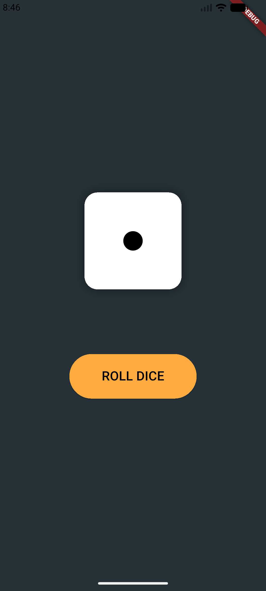
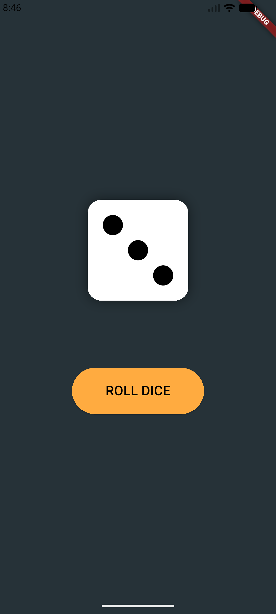

# Flutter Dice Game

### Project Description

*

Hard Work Always Pays Off. Thats True. But the Truth is Things Don't Need to be Difficult Comming Back to This Project Below is the Initial State When App Starts

*

*

After Clicking The Dice Changes As per Below Image....

*

*

After Clicking on the Button the Dice Starts Rolling and the Number is Displayed

*

## Getting Started

This project is a starting point for Learning all the Dart Programming Basics Needed for OOP related coding.

A few resources to get you started if this is your first Flutter project:

- [Learn Dart](https://www.geeksforgeeks.org/dart/dart-tutorial)
- [Tutedude](https://www.tutedude.com)