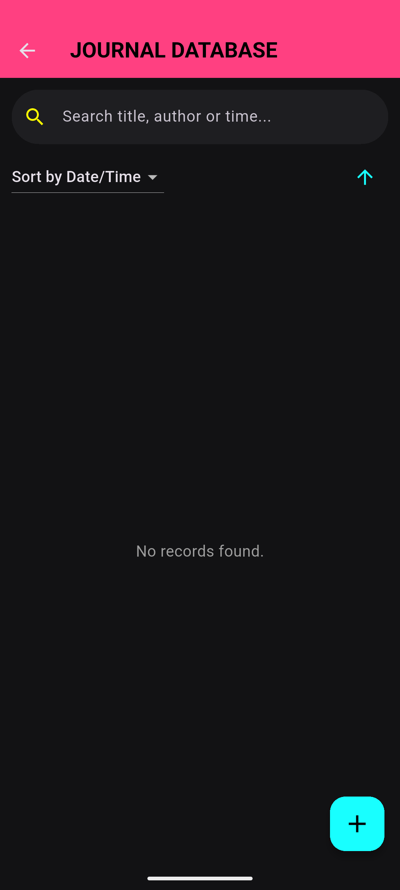
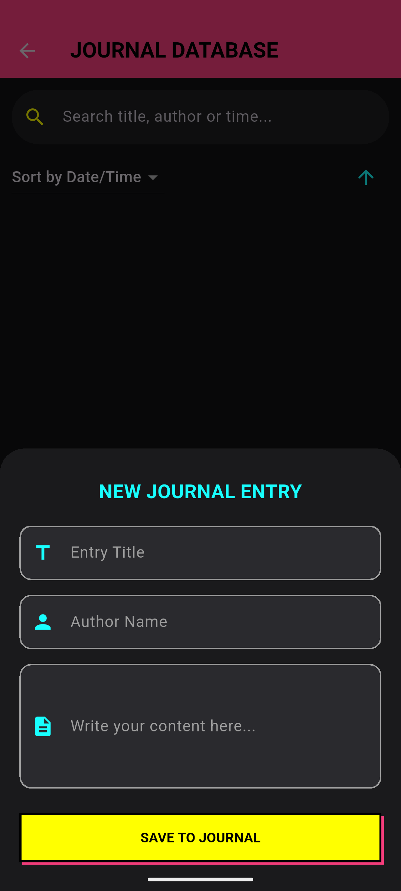
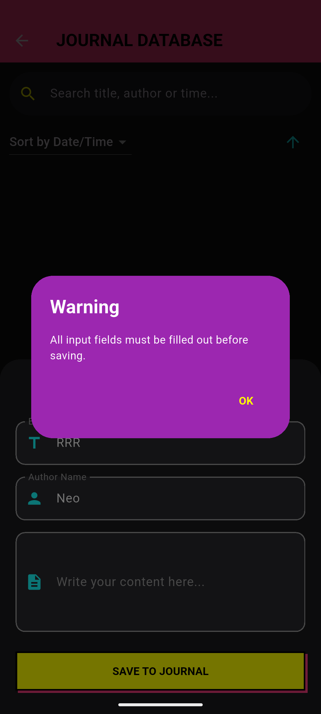
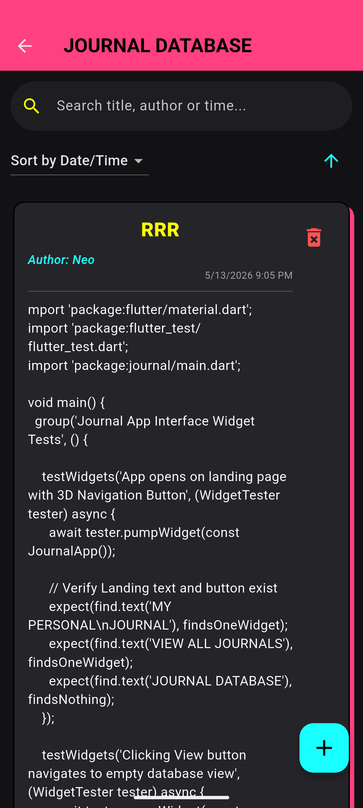
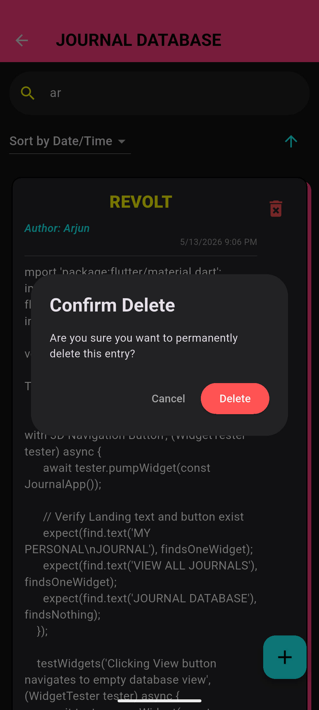
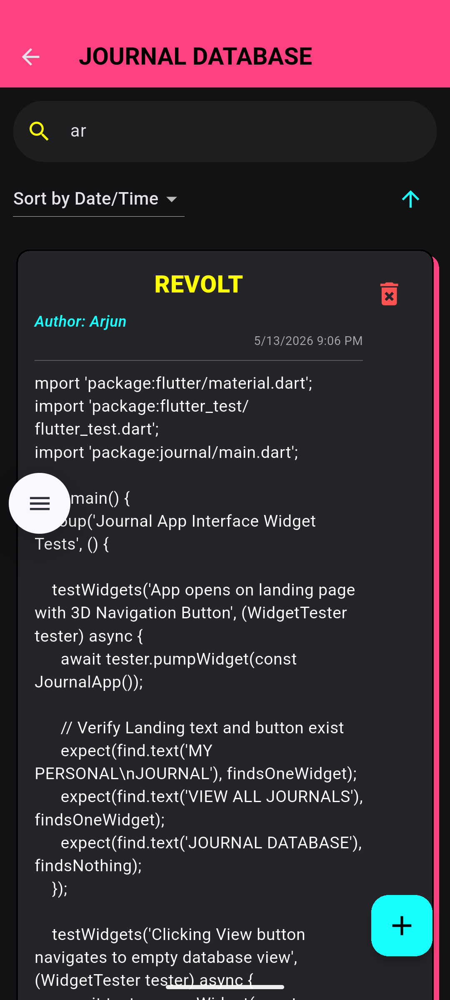
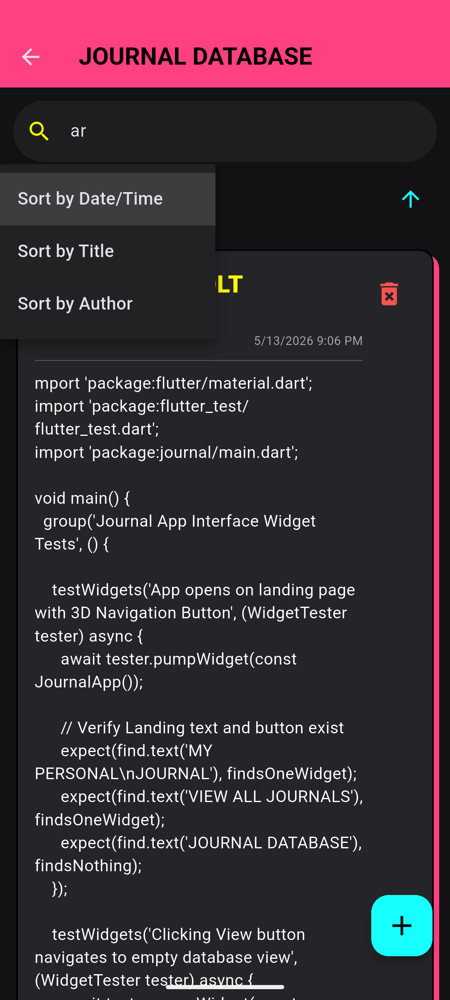
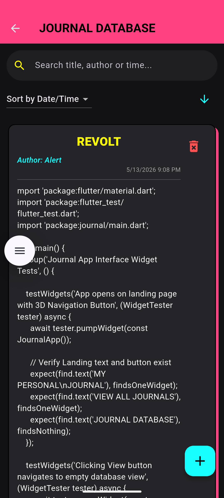
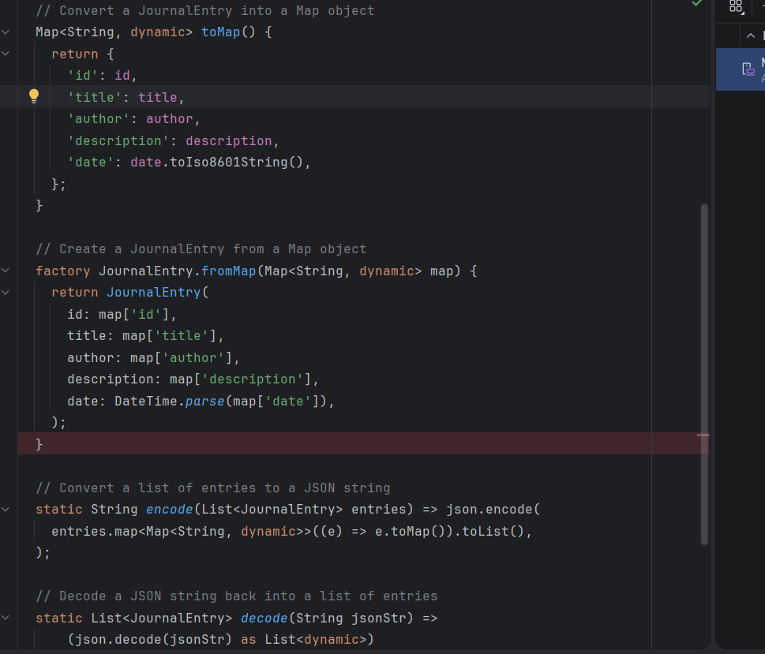

# Multi User Journal Application
*

A Journal is a User Enters His Small Paragraphs for as a Record for Various Purposes. Can be Both Personal, Study Purpose, General, or Any Other Thing. So This Project is Developed For that Purpose only. To Handle this Diversity With Minimal Changes. 

It Uses a Structure Where a Single User or Multiple Users can Use the App At the Same Time. Just Enter the Same Author Name.

This Structure can be Used For Purposes Like Note Exchange Between Friends and Much More. The Server Integration Part In This Kind of App is Out of Scope For this Assignment so We Will Avoid that.

In This Assignment We Were Supposed to Build a Flutter App Where We Can Add Journal Entries with title, Description, and date-or-timestamp.

We can View the Entries as a list. In Regards to that the Below Aplication has been Created Considering User Necessaties While Handling Journal Entries. For Example, there can be more than one people Entering Journal Entries, Plus We May also Need to Remove Entry. 

For Further Details you can Go through the Below Explaination....

*
### Project Screenshots
*

This is the Main Home Screen of the Application. It is Mainly Added In the Application As a Launch pad for any other Future Service Addition. For Example Right Now We Have Just Journal Entry and View. But In Future if we Want to add any other Service Like Web Surfing, Settings, Profiles, themes or Instagram Like Social Profile View, This Screen Will Help us add Buttons for such Features.

*

*

The Main Highlight of this Assignment is the Journal Entry System. When Clicked on View Journal We End up on this Screen, Where we can See Entries As a List; A Search Option to Search for Journal Entries, and an Icon to Add Journal Entry.

*

*

After Clicking on 'Add Entry (+)' A Form Opens to Enter Our Journal With 3 Distinct Fields
    1. Title
    2. Author
    3. Content
Then theres the Save Button. The Date and Timestamp is Generated based on When the Journal is Saved. 

*

*

If Any of the Field is Incomplete A Warning Message Fires off To Complete all Field.

*

*

After Entry The View of Article/Journal Seen as Below.
A Title Big and Bold.
Below on the Left, The Author of the Journal. 
On the Right the Auto Generated Date and Timestamp of the Journal is Present.
Below it is the Main Content of Our Journal. 

*

*

If You Want to Delete a Journal You Just Need to Click on the Delete Icon in Red Color.
Once Clicked a Confirmation Page Will Appear.
After Confirmation It Will be Deleted.

*

*

The App Uses Global Search. You Just Need to Search for Anything. Just the Name or Title or Words in the Content and result will Appear Below in the View Section. 

*

*

The View Section Where we can View the Journal Has an Option to view the Content in Any Sorting form
    1. Date/Time
    2. Title
    3. Author
Based on Your Selection, the Below List Will Be Sorted

Also there is another Option on Right to view the Content in Ascending or Descending Order.

*

*

        Sorted View ==>

*

*

        For Now We Have Used Map to Store The Generated Entries In the Local Device As Per Need so that Even If We Close the App, After Reopening the Entries Wont Disappear.

        The Screenshot of the Code Faciliting the Same Has been Shared Below.

*

## Getting Started

A few resources to get you started if this is your first Flutter project:

- [Learn Dart](https://www.geeksforgeeks.org/dart/dart-tutorial)
- [Tutedude](https://www.tutedude.com)